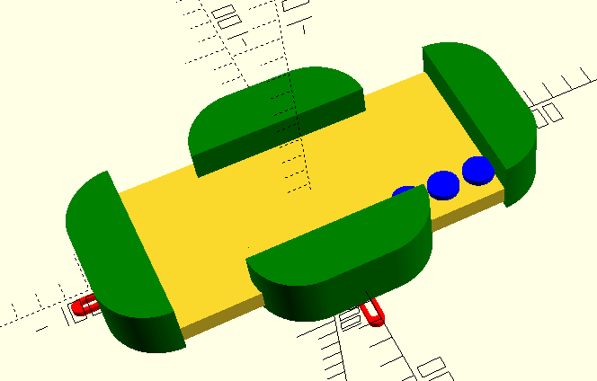

# Работа Корепановой Анны
# Проект «Цифровой окуляр микроскопа на языке OpenScad»

Модель для 3D-печати универсального захвата и окуляра для школьного микроскопа ШМ-1, которые звкрепляются на тубусе микроскопа. Захват позволяет совместить оптическую ось объектива камеры смартфона с рптической осью окуляра микроскопа.

Исходная модель захвата:
[Модель в формате STL и UPP](https://www.thingiverse.com/thing:431168) в репозитории на GitHub
Universal Phone Microscope Adapter